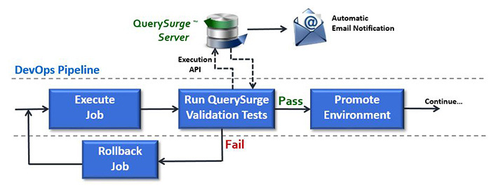

- [DevOps](#devops)
  - [1.1. What is DevOps? The Origins of DevOps Lifecycle](#11-what-is-devops-the-origins-of-devops-lifecycle)
  - [Benefits](#benefits)
    - [Technical benefits](#technical-benefits)
    - [Business benefits](#business-benefits)
- [DevOps Lifecycle](#devops-lifecycle)
  - [1. Continuous Development](#1-continuous-development)
    - [Five Steps To Setting Up A Continuous Development System](#five-steps-to-setting-up-a-continuous-development-system)
  - [2. Continuous Integration](#2-continuous-integration)
  - [3. Continuous Testing](#3-continuous-testing)
  - [4. Continuous Monitoring](#4-continuous-monitoring)
  - [5. Continuous Feedback](#5-continuous-feedback)
  - [6. Continuous Deployment](#6-continuous-deployment)
  - [7. Continuous Operations](#7-continuous-operations)
- [Devops Evolution](#devops-evolution)
- [Comprehensive list of tools category in DevOps](#comprehensive-list-of-tools-category-in-devops)
- [DataOps](#dataops)
  - [Why DevOps for Data and Testing?](#why-devops-for-data-and-testing)
  - [The Continuous Testing Process](#the-continuous-testing-process)
  - [QuerySurge DevOps for Data Use Cases](#querysurge-devops-for-data-use-cases)

# DevOps

## 1.1. What is DevOps? The Origins of DevOps Lifecycle

DevOps is the combination of cultural philosophies, practices, and tools that increases an organization’s ability to deliver applications and services at high velocity: evolving and improving products at a faster pace than organizations using traditional software development and infrastructure management processes. This speed enables organizations to better serve their customers and compete more effectively in the market.

DevOps is a simple, abbreviated term derived from the words “development” and “operations”. It involves practicing the several tasks of application development in a specific manner.

The DevOps is a combination of two words one is software Development, and second is Operations. It allows a single team to handle the entire application lifecycle, from development to testing, deployment, and operations. DevOps helps you to reduce the disconnection between software developers, quality assurance (QA) engineers, and system administrators.

Typically, DevOps teams use pipelines to streamline and standardize processes. DevOps pipelines are toolchains that teams can use to automate tasks and provide visibility into the software development life cycle. Adding AI and data science into the mix, DevOps teams gain the ability to make data-driven decisions, in addition to automated alerts and response.

Before DevOps, software applications were developed with either the waterfall model or the AGILE development model:

- The **waterfall or sequential model** was a pioneering approach in the Software Development Life Cycle (SDLC). With this model, software development becomes a linear process where different phases and tasks are positioned successively.
- **AGILE software development**, on the other hand, involved the use of various approaches and the collaboration of multiple teams in SDLC.

The linearity of the waterfall model and the cross-functionality of AGILE software development were still unable to ensure quick and continuous delivery of flawless software applications.

DevOps Services came into play by effectively serving the purpose of reducing the time involved in SDLC for prompt deliveries and securing the continuous production of high-quality, foolproof software applications.

Following are some useful prerequisites for DevOps implementation:

- Proper communication between the team members.
- At least one version control software.
- Automated testing.
- Automated deployment.

## Benefits

### Technical benefits

- Less complex problems to fix.
- Continuous software delivery.
- Faster bugs resolution.

### Business benefits

- Most stable operating environments.
- More time available to add product value.
- Faster delivery of features for customer satisfaction.
  
# DevOps Lifecycle

DevOps consists of multiple phases that collectively become the DevOps lifecycle.

1. Continuous Development
2. Continuous Integration
3. Continuous Testing
4. Continuous Feedback
5. Continuous Monitoring
6. Continuous Deployment
7. Continuous Operations

## 1. Continuous Development

In this phase planning and software coding takes place. The planning involves understanding the vision of the project and envisioning a software based on those perceptions.

Continuous development, “like agile, began as a software development methodology. Rather than improving software in one large batch, updates are made continuously, piece-by-piece, enabling software code to be delivered to customers as soon as it is completed and tested.

Planning doesn’t involve any major tools, but maintaining the code entails the use of a range of tools. Developing the source code for application begins by choosing from the different programming languages. JavaScript, C/C++, Ruby, and Python are prominently used for coding applications in DevOps.

The process of maintaining the code is called Source Code Management (SCM), where version control tools such as GIT, TFS, GitLab, Subversion, and Mercurial, among others, are used.

### Five Steps To Setting Up A Continuous Development System

Setting up a continuous development environment can be complex, but proper integration can allow companies to cut down tremendously on the time and effort that it takes to build, test and release new code. By implementing the right software, a continuous development system can be established quickly. To simplify the process of implementing an effective continuous development system, following these five steps:

1. **Implement an Agile/Scrum system**. Continuous development requires an accurate and efficient system for planning and tracking tasks and sprints with the development team. A proficient agile/scrum system will ensure that each team member is clear on what tasks are involved in each sprint, and how those tasks relate to the entire project.
2. **Use Git repository for code base**. The purpose of Git is to manage a project, or a set of files, as they change over time. Git stores this information in a data structure called a “repository”. Git is a perfect match to keep the project’s source code organized in a proper manner; especially when multiple developers are building and executing code changes.
3. **Write Tests**. Once requirements for a new feature has been given, developers should write a test, which will allow the feature to be automatically tested before it is deployed. If the feature does not pass the test, feedback can be used to make necessary changes to the code.
4. **Connect Git repository to DeployBot for automated deployment**. DeployBot’s features make it simple for developers to automatically deploy their code into a live environment once it has passed required tests.
5. **Configure DeployBot to prepare automated deployment with each new release**. With DeployBot, new code can be deployed manually, or setup to deploy on every push to a new branch.

Even a simple continuous development process introduces a vast number of benefits, but it does need to be well-thought out and perfectly executed.

DeployBot streamlines the code deployment process, which is critical to implementing an efficient continuous development system. Not only does DeployBot allow users to watch deployment progress in real time, it also removes the need to manually track changes and allows developers to quickly rollback a problematic release.

## 2. Continuous Integration

This stage is the heart of the entire DevOps lifecycle. It is a software development practice in which the developers require to commit changes to the source code more frequently. This may be on a daily or weekly basis. Then every commit is built, and this allows early detection of problems if they are present. Building code is not only involved compilation, but it also includes unit testing, integration testing, code review, and packaging.

The code supporting new functionality is continuously integrated with the existing code. Therefore, there is continuous development of software. The updated code needs to be integrated continuously and smoothly with the systems to reflect changes to the end-users.

Jenkins is a popular tool used in this phase. Whenever there is a change in the Git repository, then Jenkins fetches the updated code and prepares a build of that code, which is an executable file in the form of war or jar. Then this build is forwarded to the test server or the production server.

## 3. Continuous Testing

Continuous testing is the execution of automated tests that are triggered by another process and provide immediate feedback on risks.

This phase, where the developed software is continuously testing for bugs. For constant testing, automation testing tools such as **TestNG, JUnit, Selenium**, etc are used. These tools allow QAs to test multiple code-bases thoroughly in parallel to ensure that there is no flaw in the functionality. In this phase, Docker Containers can be used for simulating the test environment.

**Selenium** does the automation testing, and **TestNG** generates the reports. This entire testing phase can automate with the help of a Continuous Integration tool called Jenkins.

Selenium => TestNG => Reports

Automation testing saves a lot of time and effort for executing the tests instead of doing this manually. Apart from that, report generation is a big plus. The task of evaluating the test cases that failed in a test suite gets simpler. Also, we can schedule the execution of the test cases at predefined times. After testing, the code is continuously integrated with the existing code.

## 4. Continuous Monitoring

Monitoring is a phase that involves all the operational factors of the entire DevOps process, where important information about the use of the software is recorded and carefully processed to find out trends and identify problem areas. Usually, the monitoring is integrated within the operational capabilities of the software application.

It may occur in the form of documentation files or maybe produce large-scale data about the application parameters when it is in a continuous use position. The system errors such as server not reachable, low memory, etc are resolved in this phase. It maintains the security and availability of the service.

## 5. Continuous Feedback

The application development is consistently improved by analyzing the results from the operations of the software. This is carried out by placing the critical phase of constant feedback between the operations and the development of the next version of the current software application.

The continuity is the essential factor in the DevOps as it removes the unnecessary steps which are required to take a software application from development, using it to find out its issues and then producing a better version. It kills the efficiency that may be possible with the app and reduce the number of interested customers.

## 6. Continuous Deployment

In this phase, the code is deployed to the production servers. Also, it is essential to ensure that the code is correctly used on all the servers.

The new code is deployed continuously, and configuration management tools play an essential role in executing tasks frequently and quickly. Here are some popular tools which are used in this phase, such as Chef, Puppet, Ansible, and SaltStack.

Containerization tools are also playing an essential role in the deployment phase. Vagrant and Docker are popular tools that are used for this purpose. These tools help to produce consistency across development, staging, testing, and production environment. They also help in scaling up and scaling down instances softly.

Containerization tools help to maintain consistency across the environments where the application is tested, developed, and deployed. There is no chance of errors or failure in the production environment as they package and replicate the same dependencies and packages used in the testing, development, and staging environment. It makes the application easy to run on different computers.

## 7. Continuous Operations

All DevOps operations are based on the continuity with complete automation of the release process and allow the organization to accelerate the overall time to market continuingly.

It is clear from the discussion that continuity is the critical factor in the DevOps in removing steps that often distract the development, take it longer to detect issues and produce a better version of the product after several months. With DevOps, we can make any software product more efficient and increase the overall count of interested customers in your product.

# Devops Evolution

Although DevOps has been around for just over a decade, it has continued to evolve. New DevOps technologies and changing infrastructure have caused teams to adapt and technology advancements that will continue to drive change. Below are a few of the ways you can expect DevOps to evolve in 2021 and beyond.

- **AI and Data Science**
  
Artificial intelligence (AI) and machine learning have significant potential to improve current DevOps processes. Teams can use AI to identify inefficiencies in pipelines, optimize testing or evaluate user needs. Increasing amounts of data about environments, customers, markets and individual habits can all be applied to increase productivity and, ultimately, revenues.

- **Serverless Architectures**
Serverless platforms, such as the AWS serverless ecosystem, including AWS Lambda and Fargate and the Azure serverless platform, including Azure Functions and Azure App Service, are becoming increasingly popular. These platforms enable DevOps teams to focus on just their code and eliminate many other variables, such as concern for host operating systems. These architectures provide scalability, deployment speeds, and user experiences that are difficult to match. This value will further secure FaaS in the coming years.

- **Cloud-Native**
The growth of cloud-native applications has both driven and been driven by widespread adoption of cloud services. The containers and microservices that make up many cloud applications are used in many pipeline deployments and environments. Efficiently developing cloud-native applications require agility and automation that are difficult to meet without DevOps strategies.

For the above reasons, DevOps has become almost synonymous with cloud-native. As cloud-native technologies change, tooling and processes adapt, as well. Additionally, since cloud growth isn’t slowing down, you can expect that DevOps will continue to focus on and refine cloud-native development.

- **DevSecOps**
When developing applications in an automated CI/CD pipeline, security cannot be an afterthought. Especially in complex microservices architectures, security must be built in from the planning and development stages. Everyone must be aware of security requirements – developers, DevOps engineers and infrastructure teams.

Transitioning to a DevSecOps paradigm requires a culture change, but also a new technology stack. Shifting security left requires tight integration of application security tooling into the development life cycle, and implementation of cloud security solutions that can help gain visibility, and apply automated security controls, to complex cloud environments.

# Comprehensive list of tools category in DevOps

1. Continuous Integration (CI) tools : Jenkins, CircleCI, Travis CI, GitLab CI/CD, Bamboo, Codeship.
2. Continuous Delivery (CD) tools : Spinnaker, Harness, ArgoCD, GitOps, DeployHub, Flux.
3. Configuration Management tools : Ansible, Chef, Puppet, SaltStack, Terraform, CloudFormation.
4. Infrastructure as Code (IaC) tools : AWS CloudFormation, Terraform, Azure Resource Manager, Google Cloud Deployment Manager, Puppet Bolt.
5. Containerization tools : Docker, Kubernetes, Mesosphere, OpenShift, Nomad, Amazon ECS.
6. Monitoring and Logging tools : Nagios, Prometheus, Grafana, ELK stack, Splunk, Datadog,
7. Network Monitoring Tools : Catchpoint
8. Application Monitoring Tools : SignalFx AppDynamics Raygun New Relic
9. Infrastructure Monitoring tools : Zabbix, Nagios, Sensu, Icinga, Cacti, Munin.
10. Collaboration and Project Management tools : Jira, Trello, Asana, Basecamp, Confluence, GitLab.
11. Version Control tools : Git, GitHub, GitLab, Bitbucket, SVN, Perforce.
12. Code Review tools : Crucible, Gerrit, CodeCollaborator, Review Board, Phabricator, GitLab.
13. Release Management tools : ReleaseHub, GoCD, XebiaLabs, Octopus Deploy, ElectricFlow, Plutora.
14. Cloud Management tools : CloudFormation, CloudTrail, CloudWatch, CloudBerry, Cloudyn, ParkMyCloud.
15. Security tools : Aqua Security, Twistlock, Sysdig Secure, Anchore, SonarQube, Fortify.
16. Testing and QA tools : Selenium, Appium, Cucumber, JUnit, TestNG, Postman.
17. Data Validation Tools : QuerySurge
18. Build tools : Gradle, Maven, Ant, Make, MSBuild, sbt.
19. Artifact Repository Management tools : Nexus, JFrog Artifactory, Docker Hub, Amazon ECR, GitLab.
20. Performance Testing tools : JMeter, LoadRunner, Gatling, Apache Bench, BlazeMeter, Flood.
21. Dependency Management tools : Maven, Gradle, SBT, Leiningen, Bundler, Composer.
22. Database Management tools : Liquibase, Flyway, Redgate SQL, Toad for SQL Server, dbForge Studio.
23. API Management tools : Apigee, Amazon API Gateway, Kong, Tyk, WSO2, 3scale.
24. Code Profiling tools : JProfiler, YourKit Java Profiler, VisualVM, Gprof, Valgrind, Perf.
25. Deployment Automation tools : AWS CodeDeploy, Jenkins, Octopus Deploy, Chef, Puppet, Ansible.
26. ChatOps tools : Slack, HipChat, Mattermost, Microsoft Teams, Stride, Rocket.Chat.
27. Code Coverage tools : Cobertura, JaCoCo, Clover, Emma, SimpleCov, Coveralls.
28. Incident Management tools : PagerDuty, VictorOps, OpsGenie, AlertOps, xMatters, Squadcast.
29. Cloud Orchestration tools : Cloudify, Apache Brooklyn, Scalr, CloudBolt, RightScale, IBM Cloud Orchestrator.
30. Code Quality tools : SonarQube, CodeClimate, ESLint, PMD, FindBugs, Checkstyle.
31. Package Management tools : apt-get, yum, NuGet, Chocolatey, Homebrew, RPM.
32. Compliance and Governance tools : Chef Compliance, Puppet Enterprise, Red Hat Satellite, Twistlock, Sysdig Secure.
33. Automation Frameworks : Robot Framework, Selenium, Cucumber, Behave, TestCafe, TestComplete.

# DataOps

A DevOps-type of automated process for data, known as DevOps for Data or DataOps applies DevOps tools and techniques to data.

## Why DevOps for Data and Testing?

Development teams need to validate data in an ETL process when the process is completed. Operations teams needs to validate the new data every day. And both teams need to collaborate on this. How can you solve this?

## The Continuous Testing Process

The Development team builds and runs unit tests as ETL code is developed, for immediate testing as code is committed, catching issues in the ETL code quickly and reducing remediation costs.

The QA team designs and executes tests during the development cycle to provide the development team with quick feedback on each ETL build deployed, helping to pinpoint where defects appear in the code.

The Operations team executes tests automatically — after ETL execution — on a regular daily cycle.

Tests in DataOps have a role in both the Value and Innovation Pipelines. In the Value Pipeline, tests monitor the data values flowing through the data factory to catch anomalies or flag data values outside statistical norms. In the Innovation Pipeline, tests validate new analytics before deploying them”

QuerySurge, the smart data testing solution that automates validation & testing of critical data, is the first-of-its-kind full DevOps solution for continuous data testing.

With our new QuerySurge DevOps for Data release:

- Testers can choose between a Command Line API or a RESTful API
- Teams have access to 100+ API calls with hundreds of different properties
- Our Swagger documentation allows Testers to try QuerySurge’s RESTful API services to see the results before using them live in their code
- Testers can dynamically generate, execute, and update tests and data stores utilizing API calls
- QuerySurge integrates with virtually all DevOps solutions in the marketplace

QuerySurge DevOps for Data dramatically increases the automation in your current data testing practice and provides validation of your DataOps pipeline.

API Features Include the ability to create and modify:

- source and target test queries
- connections to data stores
- tests associated with an execution suite
- new staging tables from various data connections
- custom flow controls based on run results

## QuerySurge DevOps for Data Use Cases

Use Case Example #1

QuerySurge tests are automatically initiated after ETL execution completes and conditional logic is applied based on specific results of those executions.

